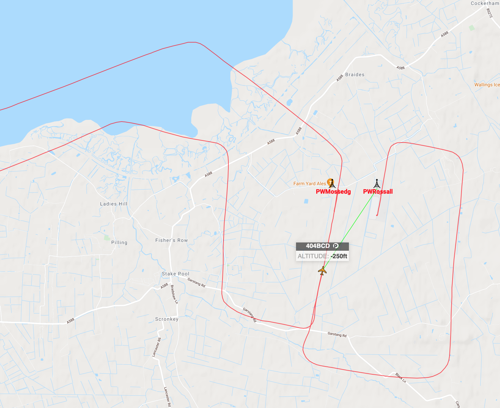

# Electronic Conspicuity at Rossall Field

You may have noticed me, James, Mark, Joe and Wayne playing with large toasting forks and computer networks in recent days, this has all been in aid of improved Electronic Conspicuity and so here are the details of what we have done and how this can help you.

[Pilotaware ATOM](https://www.pilotaware.com/atom)

[Glider Radar](https://www.gliderradar.com/center/53.96235,-2.76512/zoom/12/time/15)

[Track playback](https://aircrew.co.uk/playback/groundstations/?ICAO=404BCD&RxType=PAW&adbVariant=*&Station=*&start=1630494000&end=1630504800)

[A sample track playback](https://aircrew.co.uk/playback/groundstations/?ICAO=404BCD&RxType=PAW&adbVariant=*&Station=*&start=1630494000&end=1630504800)

[Pilotaware Vector](https://www.pilotaware.com/analysis/vector)

