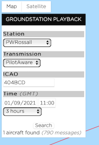

# Electronic Conspicuity at Rossall Field

You may have noticed me, James, Mark, Joe and Wayne playing with large toasting forks and computer networks in recent days, this has all been in aid of improved Electronic Conspicuity and so here are the details of what we have done and how this can help you.

We have installed and commissioned a Pilotaware ATOM station which is designed to share electronic conspicuity information. Have a read below for more details of what information is collected and rebroadcast.

[Pilotaware ATOM](https://www.pilotaware.com/atom)

Do you have to be an existing Pilotaware user? Yes, but no.

To get the full benefit of this facility then yes. I run my Pilotaware connected to my Skydemon tablet with an 3mm jack audio connection from my Pilotaware Rosetta to my MicroAvionics powered interface which also has a bluetooth connection back to the Skydemon tablet.

This provides me with audio and visual information from other Pilotaware users in the sky and also information relayed through the network of ATOM stations.

I am aware that there are many SkyEcho users at the club. Pilotaware can ingest the ADSB-Out information from SkyEcho and make this available to Pilotaware users through the ATOM Grid.

You can use Pilotaware services to optimise the installation of your SkyEcho and other EC devices using their 'vector' service. Follow the links below and you will be able to see where you EC signal is being blocked. This is usually by water (humans) or metal objects (engine / bodywork). Remember that it is most useful to know what is in front of you.

[Pilotaware Vector](https://www.pilotaware.com/analysis/vector)

Here is a quick sample from my microlight installation. If you don't know your ICAO code, then you can find it from [G-INFO CAA Site](https://siteapps.caa.co.uk/g-info/)

Pick the date by clicking on the date to the right and select or deselect the days you are interested in analysing. This is of use in tracking improvements or degredations in the efficacy of your installation.

Then press 'Go' and look at the data.

Note that this data is just from circuits, so range is not impressive, but looks like I will need to check out what is happening at 10 o'clock. Maybe I will fly higher for a bit longer and then see how it looks before I make any changes.

[Glider Radar](https://www.gliderradar.com/center/53.96235,-2.76512/zoom/12/time/15)

[Track playback](https://aircrew.co.uk/playback/groundstations/?ICAO=404BCD&RxType=PAW&adbVariant=*&Station=*&start=1630494000&end=1630504800)

[A sample track playback](https://aircrew.co.uk/playback/groundstations/?ICAO=404BCD&RxType=PAW&adbVariant=*&Station=*&start=1630494000&end=1630504800)

